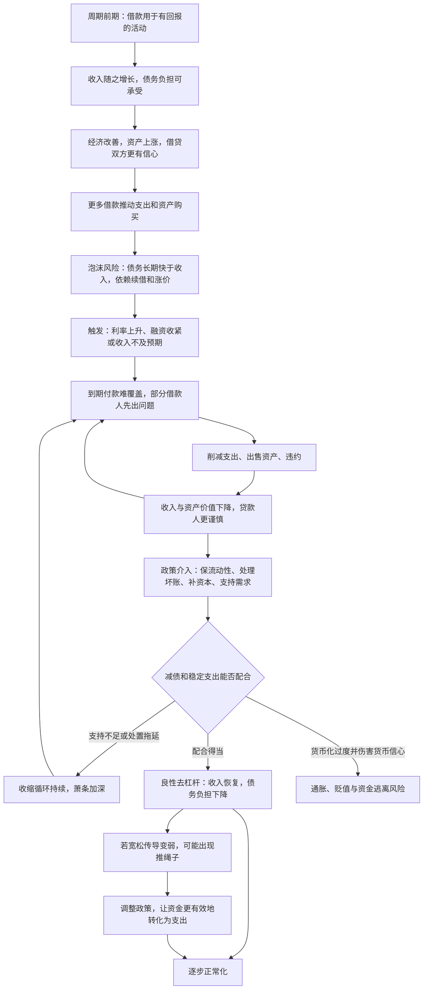
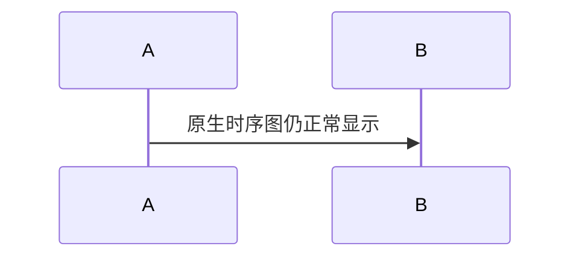

# 增强流程图

此页使用普通 Mermaid 代码块，与其他笔记采用相同的渲染入口。

## 中文分支与反馈环

```mermaid
flowchart TD
    A[周期前期：借款用于有回报的活动] --> B[收入随之增长，债务负担可承受]
    B --> C[经济改善，资产上涨，借贷双方更有信心]
    C --> D[更多借款推动支出和资产购买]
    D --> E[泡沫风险：债务长期快于收入，依赖续借和涨价]
    E --> F[触发：利率上升、融资收紧或收入不及预期]
    F --> G[到期付款难覆盖，部分借款人先出问题]
    G --> H[削减支出、出售资产、违约]
    H --> I[收入与资产价值下降，贷款人更谨慎]
    I --> G
    I --> J[政策介入：保流动性、处理坏账、补资本、支持需求]
    J --> K{减债和稳定支出能否配合}
    K -->|支持不足或处置拖延| L[收缩循环持续，萧条加深]
    L --> G
    K -->|配合得当| M[良性去杠杆：收入恢复，债务负担下降]
    K -->|货币化过度并伤害货币信心| N[通胀、贬值与资金逃离风险]
    M --> O[若宽松传导变弱，可能出现推绳子]
    O --> P[调整政策，让资金更有效地转化为支出]
    M --> Q[逐步正常化]
    P --> Q
```

## 回退检查

以下时序图应继续由原生 Mermaid 正常显示：

```mermaid
sequenceDiagram
    A->>B: 原生时序图仍正常显示
```
