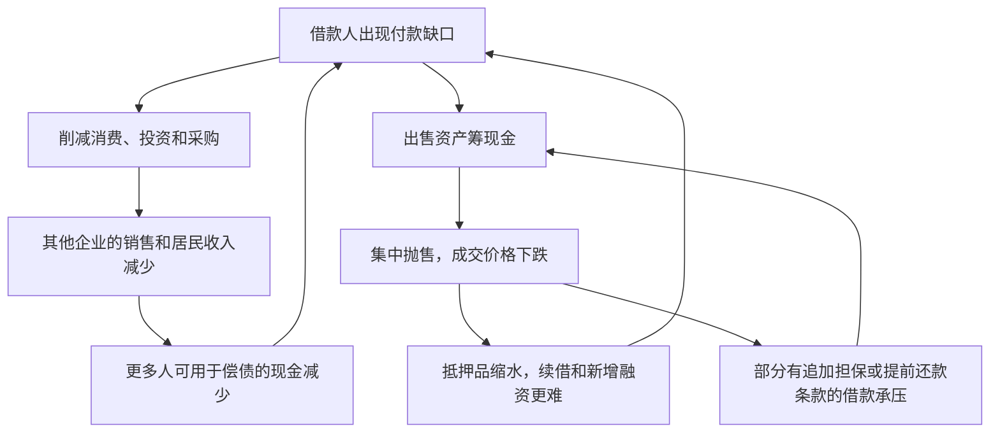
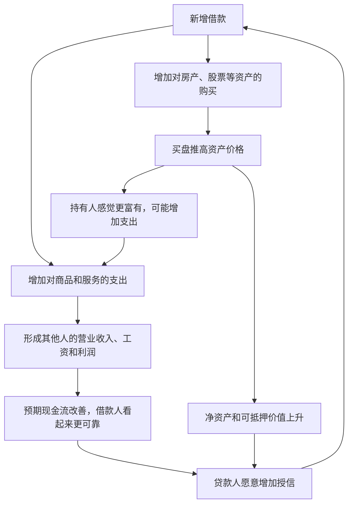

# 债务周期反馈环

来自《债务危机》章节导读的两个反馈环，用于检查拥挤布局中的折返连线。

## 通缩与抛售

“集中抛售”到“抵押品缩水”、“付款缺口”到“出售资产”应最多转折两次。

```mermaid
flowchart TD
    A[借款人出现付款缺口] --> B[削减消费、投资和采购]
    B --> C[其他企业的销售和居民收入减少]
    C --> D[更多人可用于偿债的现金减少]
    D --> A
    A --> E[出售资产筹现金]
    E --> F[集中抛售，成交价格下跌]
    F --> G[抵押品缩水，续借和新增融资更难]
    G --> A
    F --> H[部分有追加担保或提前还款条款的借款承压]
    H --> E
```

## 信贷与资产上涨

“增加资产购买”到“买盘推高资产价格”的回路线应最多转折两次。

```mermaid
flowchart TD
    A[新增借款] --> B[增加对商品和服务的支出]
    B --> C[形成其他人的营业收入、工资和利润]
    C --> D[预期现金流改善，借款人看起来更可靠]
    D --> E[贷款人愿意增加授信]
    E --> A
    A --> F[增加对房产、股票等资产的购买]
    F --> G[买盘推高资产价格]
    G --> H[净资产和可抵押价值上升]
    H --> E
    G --> I[持有人感觉更富有，可能增加支出]
    I --> B
```
