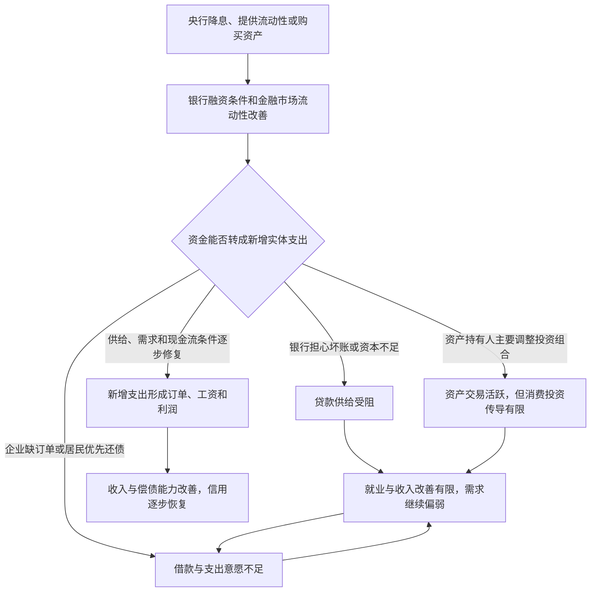

# 宽节点承接长分支

“借款与支出意愿不足”可适度加宽，承接从“资金能否转成新增实体支出”穿过空白区域的直线，同时保持图表整体尺寸紧凑。

```mermaid
flowchart TD
    A[央行降息、提供流动性或购买资产] --> B[银行融资条件和金融市场流动性改善]
    B --> C{资金能否转成新增实体支出}
    C -->|银行担心坏账或资本不足| D[贷款供给受阻]
    C -->|企业缺订单或居民优先还债| E[借款与支出意愿不足]
    C -->|资产持有人主要调整投资组合| F[资产交易活跃，但消费投资传导有限]
    D --> G[就业与收入改善有限，需求继续偏弱]
    E --> G
    F --> G
    G --> E
    C -->|供给、需求和现金流条件逐步修复| H[新增支出形成订单、工资和利润]
    H --> I[收入与偿债能力改善，信用逐步恢复]
```
