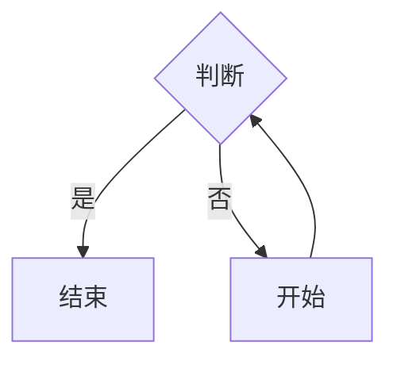
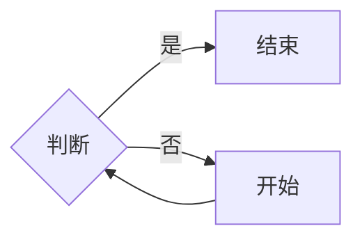

# 简单双向回路

以 A 为阅读起点，主流程向下或向右展开；B 返回 A 的边作为回边走外侧通道。反向的 BT/RL 不列入专项布局验收。

## 从上到下

```mermaid
flowchart TD
    B -->|是| C[结束]
    A[开始] --> B{判断}
    B -->|否| A
```

## 从左到右

```mermaid
flowchart LR
    B -->|是| C[结束]
    A[开始] --> B{判断}
    B -->|否| A
```
